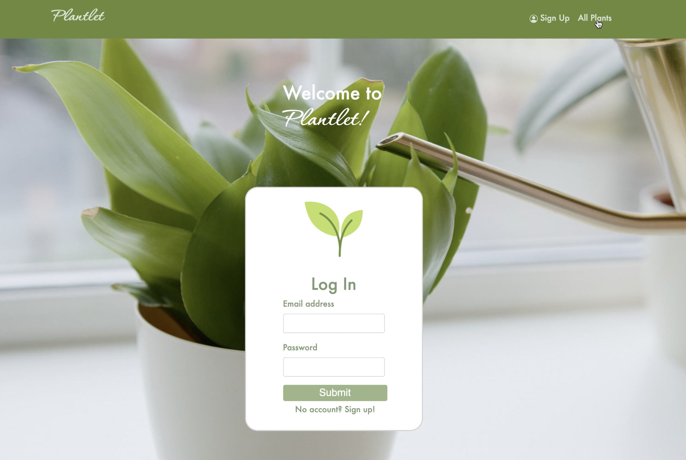

### Plantlet Project Proposal🌱

### [Project Demo Video](https://youtu.be/xxH5ZIxp2Ag)

### Overview🌿

Plant Care Made Easy!

Plantlet is a plant care application which allows users to browse indoor plants, save plants to their plant dashboard, 
store plant data, graphically track their plant's progress over time, and view directions to plant shops on a map!  

CSV plant data credit: https://github.com/rubui

### Technologies Used💻

- Python (flask)
- Jinja
- JavaScript, chart.js
- PostgreSQL
- RESTful API
- Bootstrap
- Mapbox API
- Unit Testing
- CSS
- HTML

### Python Libraries Used📚 

- Flask Bootstrap - Style
- Datetime - Date and Time
- Werkzeug - Security (Hash passwords)

### JavaScript Library Used

- Chart.js

### Data📈

- User email, password
- Plant common name, scientific name, image, water needs, soil and light preferences
- User Plant (associates plants with specific user)
- Plant growth data
- Plant condition data
- Plant notes data

### MVP🌻
- Users can login
- Users without an account can search plant database
- Users with an account can search for plants, view a specific plant, the plant's image & other details
- Users can add plant to their plant dashboard

### 2.0🪴

- Users can store notes about their plants
- Users can record plant growth and condition
- Users can view plant condition over time via a graph
- Users can view directions to plant shops on a map 
- Hash passwords
- Implement unit testing

### 3.0 (Future iterations) 👽
- Twilio API to send plant watering reminders
- User authentication features 
- Add Yelp API to map so users can view closest plant shops with zipcode and read plant shop reviews
- Users can view plant growth data
- Users can delete plant notes

### 4.0🚀
- Implement React
